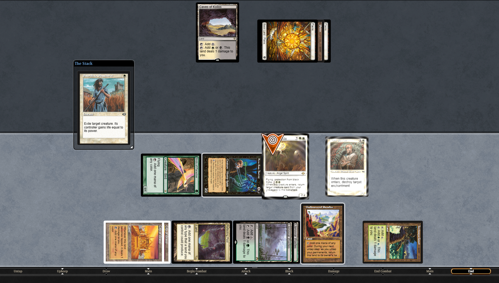
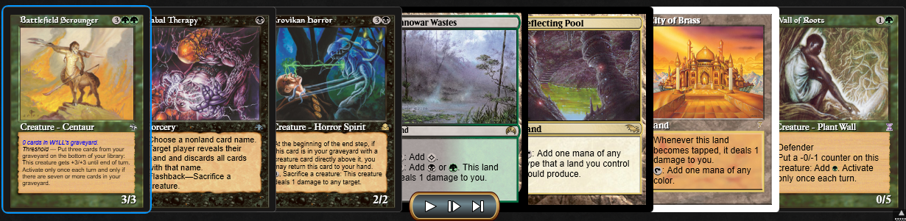
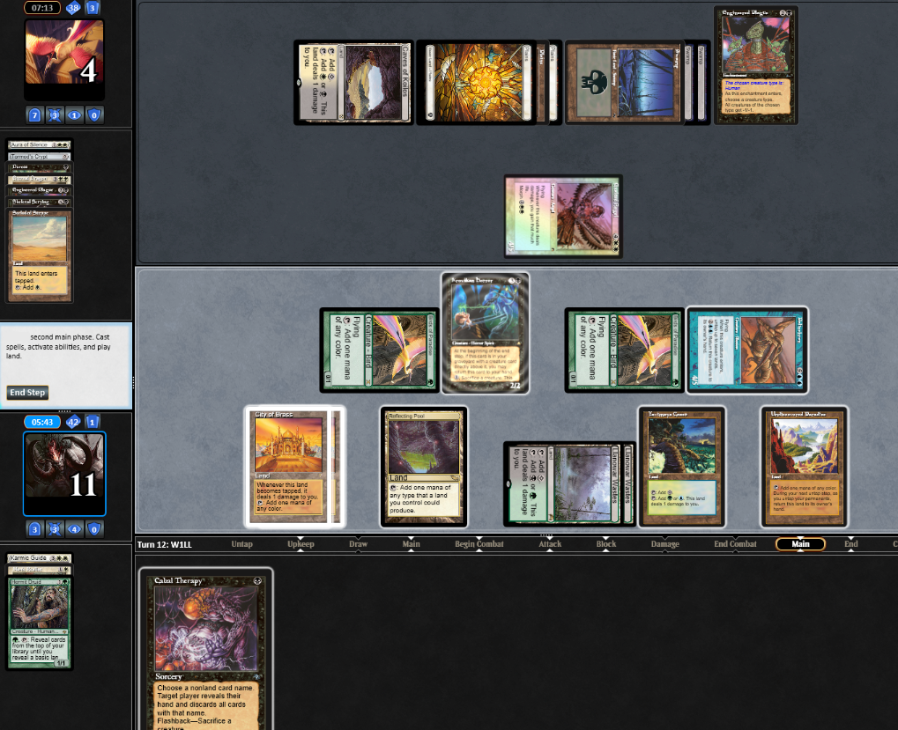
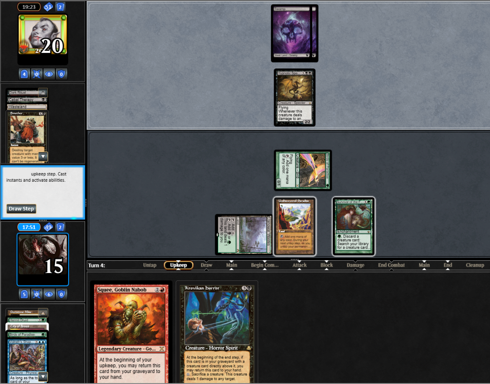

I think that hFEB has flown under the radar for longer than other dangerous combo decks in Premodern, mostly because of how inaccessible it was. Becoming playable on MTGO changed that, resulting in a surge of new pilots that showed up in force at Lobstercon '26. That's where I met Biel, (and many other combo degenerates). We got to talking about the increased rate at which people were trying the deck, and how that might inform our strategy going forward.

hFEB is a deck that gets a real portion of its wins from people just not knowing how it works. But that advantage will surely fade as players continue to encounter it. It seems likely that we will need to continue to build resiliency in the face of an increasingly FEB-savvy player base. So I set out to try some new things, and be disciplined about measuring my results. The first card I decided to vet is this spooky dude:



For a deck with so few flex slots, you can easily slot in a "One of Fun of" without sacrificing too much, thanks to Survival of the Fittest. If you're not offended by 61 cards, you don't even have to cut anything! I decided to give Horror the slot that Mesmeric Fiend was occupying in my list. It kinda looks like redundancy for squee (spoiler: it's not), and offers some novel tools if you can get it into play. The sacrifice being part of the cost matches up with the other sneaky ways hFEB bypasses the stack (e.g. Psychatog, Battlefield Scrounger). The direct damage is also sorely needed in a world filled with Withered Wretch and Meddling Mage.

Its other value is as a narrow optimization of the "Only 1 Creature In Hand" FEB Kill:

In Play: Survival, 6 mana (1UUGGG, including at least 3 lands that tap for G).
In Hand: one useless creature that you just drew for the turn

1. G: Discard the useless creature for Krovikan Horror
2. G: Discard Krovikan Horror for Palinchron
3. G: Discard Palinchron for Volrath's Shapeshifter
4. 1UU: Cast Volrath's Shapeshifter and untap your lands
5. Pass to your end step. Krovikan Horror's return ability triggers
6. Still in the end step with Horror now in hand, pitch it for Phyrexian Devourer
7. Pitch Phyrexian Devourer for Triskelion
8. Do the rest of the FEB combo

Compared to building the Triskelion/Devourer Karmic Guide line, this costs 1 less mana. Technology! But also a bit narrow. You can accomplish the same thing if you start in your opponent's end step by sequencing Squee into palinchron, and palinchron into shifter. So really, the only thing Horror is doing here that Squee can't is immediately convert a topdecked creature into a win in late-game scenarios where you have six mana and survival but no cards in hand.

## We Ball

It's hard to tell if those reasons are any good! So I tested it. In general this is how I approach not just magic, but all games. Imagination and theory can only get you so far, and if you keep an open mind you may find something worthwhile.

I played 128 games with Krovikan Horror in my main deck. 99 of those games were on MTGO, plus two weeklies at ELDs Timevault Games and the May [Premodern Webcam League](https://www.premodernseries.org/webcam-leagues).

I don't want to bury the lead here: my conclusion is that Horror doesn't improve the deck's resiliency, at least not in the ways I was expecting. I hope that the time I spent testing it either saves you some time, or sparks new ideas. Let's get into the specifics.

### Low Opportunity Cost

This point is less about Krovikan Horror and more an acknowledgement that changing 1 card in an established deck is unlikely to have that much of an impact. The vast majority of my games did not feature Krovikan Horror, and my winrate was not significantly tilted up or down. At the worst, it still pitches to survival.

### Sacrifice Outlet

Putting Karmic Guide into play can be dangerous because it is a key piece of the Hermit kill, but its ETB trigger can be quite valuable combined with our sideboard creatures, like Monk Realist. This interaction allowed me to clean up my opponents Engineered Plague AND Seal of Cleansing without turning off the Hermit Kill; when my opponent went to plow the Karmic Guide, I could sacrifice it to Karmic Guide from becoming a farmer.

### Removal

To test my hypothesis that Horror is good in grindy games, I kept these cards in game 2 versus The Rock.

The first 3 turns consisted of my opponent casting Duress and Cabal Therapies to take my own Therapy, Wall, and Scrounger. I cast the horror on turn 4. Combined with an expiring wall of roots I was able to keep his Ravenous Rats off the table and preserve the ability to get the horror back. Eventually my opponent ran out a plague bearer, but I was able to sacrifice the horror to kill it, which ensured that my Hermit Druid lived long enough to activate and win.

### Reach

It may not be play A or plan B, but the plan C of just attacking with our creatures is enhanced when you can close out the last few points with direct damage:

This is particularly potent vs Exalted Angel since you can sacrifice a blocking Birds of Paradise before damage to prevent the life gain from triggering.

### Insulation vs Discard

Horror can be very good vs a turn 1 Hypnotic Specter. If you can manage to get all your non-creature cards out of your hand, the Horror will start taking bullets for you. Moneyball can be a difficult matchup, but they will have a hard time dealing with Squee + Horror.

In this game, horror was discarded to Hypnotic Specter three times, allowing me to develop my mana and eventually execute the Palinchron line.

## Lessons Learned

I didn't feel like Krovikan Horror was obviously more powerful than the cards it is competing with for the precious flex slot. Duress, Mesmeric Fiend, and the third Shapeshifter are all proven inclusions that are going to be live cards in game one more often than Krovikan Horror.

### Card Advantage but not Resilience

I wanted to try Krovikan Horror because my metagame features a lot of Mono Black decks of various flavors, which are very skill intensive for the hFEB player. It can be difficult to pull together the FEB combo when your hand is constantly under attack, and Horror fights back on that axis. I think a useful comparison is that it's like Wall of Roots, since you can use it twice a turn cycle. That's a lot of card advantage alongside survival, but it generally needs to go *with* squee, not instead of squee. It does a lot less in games where your Squee has been exiled. If you're looking for redundancy for Squee, a second squee in the sideboard is going to fill that role much better than the first Krovikan Horror.

### Mana Hungry

It's mana intensive to be pitching Horror multiple times a turn cycle. My build did not feature Eladamri's Vineyard, but I could see it working well with the bonus green mana. Similarly, my build runs a single Elvish Spirit Guide, but I can see how the Squee + Horror engine would benefit from having access to multiples. With those excess survival triggers you could build up a bank of useful cards like ESG, Mesmeric Fiend, or any of the other important sideboard creatures.

### Survival in their Second Main Phase

If you are intending to get horror back, you need to meet its return conditions BEFORE you enter their end step. This took some retraining, particularly on magic online where even a minor takeback is not possible. Learning our lines takes practice with the actual cards in your hands, and getting used to the timing for Krovikan Horror is no different.

## What's Next

I really enjoyed taking Krovikan Horror through its paces. And, I managed to qualify for the top 8 of the Premodern Webcam League with Horror in my deck so I'm not completely done playing it. The hFEB Cabal has a long list of possible innovations that need vetting, so hopefully I can help chip away at that list.

*Aside from being deeply obsessed with Premodern, Will has wasted 20 years of his life making video games. You can find his latest work at [Go On Entertainment](https://go-on-entertainment.com). He is whhthe2 on Discord.*

