### How I ended up here

Premodern is a small community and I am as much an outsider as one can be. So I thought this would be an opportunity to introduce myself.

I started playing Magic as a kid in the late 90s. My father was an avid Necropotence player, so I spent my formative years watching him Drain Life my brother for lethal at our kitchen table.

In the mid 2010s I decided to put some of my card game experience to use and had a somewhat successful eSports career playing Hearthstone professionally for a few orgs in Brazil (e.g., INTZ, Vivo Keyd, Red Canids). I played at international stages, made some dollars and had the opportunity to meet and work with tons of people, including players I had always admired from the MTG scene, like PV, Brian Kibler and Stanislav Cifka.

Then life happened and I had to shift focus to my job and paying household bills. A few years ago a friend dragged me to an FNM, the itch came back and I logged into an ancient MTGO account holding a couple of pauper staples and dust. Soon enough I was creating a new version of a deck I had played a decade ago, an archetype non-existent in the metagame: UB Trinket Mage, now playing with Blood Fountain, Grim Bauble, Campfire and Refurbished Familiar (PM me for a sweet decklist). And to my wife's despair, I was back at my nerdy hobbies having lots of fun without her.

I'm sure my experience is not unique, especially within the Premodern community, but I enjoy "played" Magic. Micro decisions. Attacking. Blocking. Counting damage. Not the power-creeped arms race it became. Soon enough my strangely precise algorithm started recommending me "Premodern tournament" (I had no idea what that was), until eventually I clicked a video, saw Dark Ritual into Hypnotic Specter being played and immediately got hooked on it.

I started messing around with a few decks for a few months on occasional nights and weekends, trying to figure out how the hell Call of the Herd can be competitive and consuming content until I saw a video from LSV on HFEB about 3 months ago. I didn't really understand the deck. Googling led me to Carl's primer. I saw a Monte Carlo simulation and knew I was in the right place.

### Why HFEB

I have never been much of a combo player. I am a hard control, hard lock player at heart. But HFEB brings too many upsides to ignore: it is competitive, complex, has high-swing and outplay potential and brings that feeling that you can win any game or match if you play right.

One of the things that drove me away from Hearthstone was RNG. Losing a die roll cost me a World Championship qualification (and at the time a life-changing amount of money). I know card games are not chess. But I want my reads and decisions to buy me win percentage. HFEB has that potential. You win games on mulligans to three. The deck presents lines even the most experienced players can't see.

That's the reason I believe HFEB is a Tier 1 deck. It just requires good piloting to get there, which makes it an average deck in average scenarios. This is the whole thesis behind this article.

### How Shallow Grave got into my list

I started with the most standard list I could find. Once I learned the core lines I started tinkering. I think the deck has around 3 or 4 slots one can play with:

* 2 or 3 flexible slots, usually filled with Duress, Vineyard, a 4th Wall of Roots, a 3rd Volrath Shapeshifter, a 3rd ESG, etc.
* The 22nd land. I experimented with this quite successfully, as the manabase (and especially the 22nd land) will suck anyway. Sometimes I will go down to 21 lands post sideboard with my current list.

I tried most of everything in those slots. Duress, Meddling Mage, Mesmeric Fiend, Enlightened Tutor and even a copy of Lim-Dul's Vault. But most of the cards would try to disrupt my opponent's game plan without advancing mine, which felt a lot more important in game 1. I wanted something that made my core strategy better.

While in the process of tinkering with what the best 75 would be, Youtube's algorithm struck again and I watched a video on Angry Hermit. In one of the games against Burn, the guy played Shallow Grave at his opponent's end of turn, brought back Hermit Druid and won the game on the following turn.

I had already noticed the card in older lists. But it seemed the community had reached a consensus against it, as nobody was playing it anymore. But given the fact I like to always have a plan against Burn (think Enlightened Tutor for CoP:Red kind of dedication to make Burn players suffer) and I was playing against Sligh every now and then, I knew I had to test the card.

I thought about testing it as a 1-off but it would take ages to get a good sample size and it would be too unreliable against red decks. So I decided to bring 2 copies of Shallow Grave into the slots of 1 Duress and 1 Unearth (as I didn't want to have that many reanimate effects).

### Floor and ceiling

Quick framework before we go on. Card evaluation often looks at three things: a card's floor, its ceiling and its opportunity cost.

* Floor is what the card does in realistic bad or average situations, without help from other cards
* Ceiling is the best it can do
* High floor means reliable. High ceiling means game changing when it works

A Lightning Bolt will always deal 3 damage to a target for 1 mana. High floor, ok ceiling. A Teferi's Response can be game winning against a Rishadan Port or rot in your hand all game. Low floor, great ceiling.

Judged in isolation, Shallow Grave has a much worse floor than Unearth. I will itemize the card-level case in the pros and cons below, but the short version is that it can sit dead in your hand and you cannot simply reanimate a creature for value.

But you are playing the card in a combo deck built to fill and manipulate the order of its own graveyard. From a ceiling standpoint, the card creates scenarios and win conditions the deck would otherwise never encounter, especially when we factor in the ability to play it at instant speed (more to come in the following sections).

### My list

This is what I have been jamming most recently. The results have been silly: ~93% (28/30) winrate in MTGO leagues, with 5 trophies out of 6 leagues played. Now, 6 leagues is a very small sample and I surely ran hotter than I deserved. Keep in mind I picked up HFEB just 3 months ago. I am no specialist and I am still tinkering with it a lot (as you can tell from the Gilded Drake in my SB). But I guess it just proves the point that HFEB is that good.

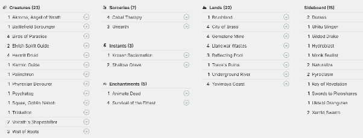

### Pros and cons of Shallow Grave

**Pros**

* Resilience against non-white removal-heavy decks. Hermit Druid stays a real WinCon against Burn, RG Zoo and Money Ball Black
* Resilience against single-target graveyard removal like Phyrexian Furnace and Withered Wretch
* Resilience against Meddling Mage
* Combo kills at instant speed
* Surprise effect: nobody plays around a card no one plays
* A real WinCon against Brainfreeze decks (Reanimate a Shapeshifter or Scrounger at instant speed in between storm copies)
* Limited experience interacting with the card: most competitive Premodern players don't even know how to interact with standard HFEB lines. SG just adds more to that

**Cons**

* 1 more mana than Unearth, which can be crucial
* Does not cycle (so it can sit dead in your hand)
* Exposes you to a removal spell targeting another one of your creatures (the WoR or BoP situation)
* Too situational. You cannot just reanimate something for board presence
* Less linear card that demands constant reassessment of the game state

The last aspect is the most important one. You have to start caring about graveyard order from turn 1 and ask questions like "Should I even cast Birds of Paradise, or will it land on top of my Hermit Druid at the worst possible moment?". The card does not fit a "memorized", one-size-fits-all approach to the deck. And the more we have to think and make decisions, the more our chance to misplay increases. And misplays will happen.

### Use cases and practical application

#### Graveyard ordering

For most standard lines the only adjustment is keeping Volrath Shapeshifter on top of Karmic Guide. Unearth it, it works. Shallow Grave it, it works too.

The versatility is what makes it shine. You get to pick the exact creature in your deck that wins that specific game from a Druid or Survival activation and resolve it at instant speed. You can bring back a hasty Psychatog and swing for lethal. Same story with Akroma, Triskelion or a Karmic Guide reanimating something big. Or my favorite: stealing the opponent's creature with a Gilded Drake that will die at the end of his turn.

#### When to cast it?

It depends entirely on the scenario, and that is one of the beauties of the card. With Unearth or other sorcery-speed cards, the lines are almost fixed and pretty much present themselves. But the ability to combo kill at instant speed offers exponentially more opportunities and possibilities.

In Hermit lines, most of the time I will cast it as a 2 mana Unearth, at sorcery speed (I know, not great). That is usually the case when the plan is to win through combat damage (Tog + Akroma line) or when I want to throw some Cabal Therapies at my opponent.

Against decks holding counterspells, I may instead hold both the Druid activation and the Shallow Grave and punish my opponent the moment he taps out (more on that in the section on permission below).

Against removal-heavy decks, it's usually best to cast it bringing back a dead Hermit Druid. If somehow we manage to have a non-summoning-sick Druid in place, we combo at their end of turn. Whatever he removes, we can untap, shuffle AD back with Krosan Reclamation, Cabal Therapy and go for the kill again (if the opponent is holding even more removal that we can't discard, we can Animate Dead the Scrounger and set up the following turns).

The same thing happens in Survival lines. Being able to combo-kill at instant speed can be game changing, especially against Rishadan Port locks or opponents holding permission. That way we gain a clear mana advantage by leveraging our untapped lands on their turn, untapping and attempting to combo again (e.g., if we go for a Palinchron + Shifter line on their turn, we can fetch Karmic Guide and go for a Shifter-Guide bringing back Palinchron and killing the opponent).

The biggest advantage of this approach is mana differential. By attempting to combo at the opponent's end of turn, we are most likely playing with 10 or 8 total mana (as we get to untap) against his 5 or 4 total to stop us.

#### Playing around graveyard hate

**Phyrexian Furnace:** you can order the graveyard so that one activation of Phyrexian Furnace does not stop our combo. Example ordering from the top: Psychatog, Shifter, Karmic Guide, Scrounger, Devourer, Triskelion. If they exile the Psychatog, you go for the Shifter-Triskelion kill (requires Krosan Reclamation to reveal Triskelion).

**Tormod's Crypt:** with two reanimation spells in hand (e.g., Unearth + SG), graveyard hate stops being a hard lock. Activate Druid. Unearth the Shifter. If they crack Tormod's Crypt in response, cast Shallow Grave with the Crypt trigger on the stack and combo off through the Scrounger line.

**Withered Wretch:** depending on the board state and amount of mana the opponent has, you can actually go for that Hermit Druid activation. Especially if your opponent is tapping all his mana to remove non-relevant cards from your GY at the end of your turn :)

#### Playing against permission

You know those games against permission where you resolve a Hermit Druid but never feel safe activating it, because the opponent is sitting on counters for your Unearth and potentially Krosan Reclamation? The moment they tap out for a Fact or Fiction or Accumulated Knowledge at your end step, you can kill them on the spot. They are never entirely safe again.

That is why, against these decks, I may decide to hold both the Druid activation and Shallow Grave for a surprise effect, going for the Scrounger kill when they tap out at the end of my turn, or on their upkeep/end of turn. That way, I can play a game of draw-go with Hermit on the board and keep the opponent in check or make him need two or more pieces of permission (one for the combo or SG and a potential counterspell for our Krosan Reclamation in our upkeep). This is especially relevant when I'm not entirely sure what to name with Cabal Therapy, when playing against decks with multiple forms of interaction.

Another nice play we can make is to activate Hermit Druid on our opponent's turn and bait them to interact with our attempt to cast Krosan Reclamation in our upkeep. In most cases, if they interact with it (e.g., counterspell, Tormod's Crypt, Brain Freeze/Vision Charm milling the cards), the game is over. But we can let them counter Krosan Reclamation and still combo off before we reach our draw step.

If they don't take the bait and decide to wait (playing around SG), we can draw an Unearth and attempt to combo with it, holding the SG as insurance against any interaction, comboing at instant speed in response to the opponent's interaction (requires a total of 5 mana).

If we are playing two copies, we can KRec the second copy of SG + Unearth and wait 2 draw steps before comboing off. E.g., cast Unearth (opponent interacts), cast SG#1 in response (opponent interacts), cast SG#2 in response.

#### The exile clause

The exile trigger can be a tool, not just a drawback.

Cast Shallow Grave at your opponent's end step and the creature sticks around until the end of the following turn (your turn). That means you have an entire turn to attack, activate anything or Cabal Therapy your opponent.

Sometimes you actually want the creature gone. You can cast it in your opponent's second main phase when you want your Hermit Druid to be exiled and not affect your graveyard order.

For damage reach with the Scrounger line, we can combo at our own end step, allowing us to shuffle more cards with Scrounger on the opponent's upkeep.

#### What if they kill another creature in response?

That is an inherent risk of playing the card. And there are four ways to manage it:

* Reduce the probability: sacrifice or trade off the vulnerable creature ahead of time (or just don't play it)
* Reduce the impact: e.g., if they kill your Wall of Roots in response, do you lose on the spot? If not, the risk may be worth taking
* Accept it. You are playing a combo deck. If your opponent has every answer, you are not winning anyway
* Avoid it. Do not include it in your 75. A legitimate choice, just not mine

### Sideboarding

Against most decks I tend to trim 1 copy of Shallow Grave for G2 and G3, as my list runs an excessive amount of reanimate effects. I will usually side out both copies against decks running Swords to Plowshares as their main removal due to the lost synergy with Hermit Druid. But I will always keep 1 if the opponent is playing Meddling Mage.

Always keep both against removal-heavy decks (e.g., Sligh, The Rock, MBB).

### Some gameplay action and lessons

#### Example 1: Shallow Grave vs. Burn

Context: it's Game 1 and I was able to find Hermit Druid and Shallow Grave.

From here, the play is obvious. On T2 assemble Hermit. On T3 cast Shallow Grave and flip our library to kill him on our turn. That sequence pretty much guarantees a turn 4 kill.

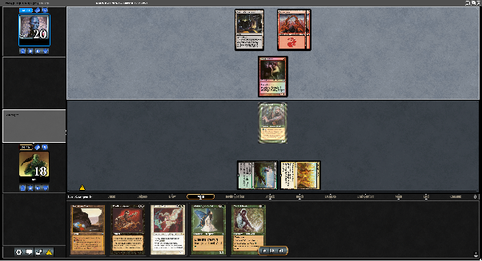

Although I won the game, on Turn 3 I made a misplay. Ideally, I should have played Shallow Grave in my opponent's second main phase. That way, my Hermit Druid would have been exiled at my opponent's end step. That means in my upkeep I could shuffle a Shallow Grave with Krosan Reclamation, play Treva's Ruins and cast Shallow Grave bringing back a Psychatog with haste to kill my opponent, giving him no chance to interact with my combo in any possible way (unless he taps his last Mountain to play another creature on his turn, in which case we could pivot our line to Animate Dead).

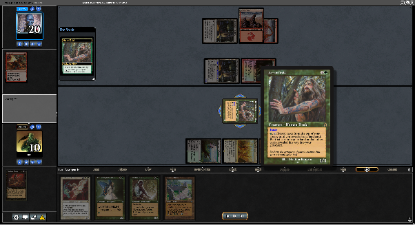

What I did instead was shuffle Animate Dead and draw it. Sac Druid to cast CT targeting my opponent and naming Lightning Bolt. Cast Wall of Roots, add G, cast Cabal Therapy targeting myself naming Karmic Guide. Play AD and kill him with Akroma. But if my opponent had a copy of Fireblast, he could have disrupted my combo in between Karmic Guide/Shifter triggers.

Just because we won, it doesn't mean we played perfectly. That is why it's very important to analyse past games (the tricky ones) when playing this deck.

#### Example 2 (Puzzle): Mitigating Shallow Grave Risk vs. Mono Red Control

Context: it's Game 1 against Mono Red Control. My opponent has sacrificed his Phyrexian Furnace to get rid of my Squee and stop my Survival engine. I noticed he is holding an untapped Mountain, which may mean he has a Lightning Bolt in hand (all lists play 4 of).

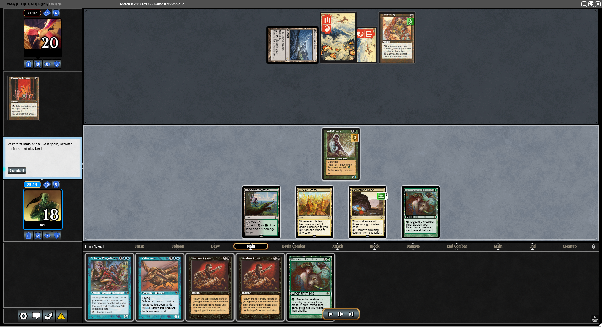

I can kill him this turn if I play Shallow Grave. The problem is: if I generate mana with my Wall of Roots, it becomes a 0/3 and the moment I cast a copy of SG, my opponent can respond by bolting the WoR, so it would come to the top of the graveyard and become the valid target for Shallow Grave.

Is there a guaranteed kill if our opponent has Lightning Bolt in this situation?

Answer:

1. Tap City of Brass to add (G), pitch Palinchron and fetch Elvish Spirit Guide
2. Tap Gemstone Mine (1 counter left) and Llanowar Wastes and cast SG
3. Palinchron comes into play and we untap our 3 lands
4. Remove ESG from hand to add (G)
5. Pitch Shifter and fetch Phyrexian Devourer
6. Tap City of Brass and Llanowar Wastes for 1B and cast Shallow Grave, bringing Shifter into play
7. Add G with Wall of Roots, pitch Phyrexian Devourer to fetch Triskelion and kill the opponent

Even if the opponent tries to Bolt the Shifter or the Wall of Roots, we can hold priority and stack activations with Shifter-Devourer and deplete our Gemstone Mine to bury the Devourer in the GY, attacking him for lethal with our hasty +X/+X Shifter (if we are unlucky and end up removing Triskelion from our library in the process of pumping our Shifter-Devourer).

#### Example 3: playing vs. Islands (???)

Context: it's Game 1 and I don't know what my opponent is playing. I'm guessing it is Grow-a-tog. So, to avoid getting blown out, I decided to play a game of draw-go as I'm not under any pressure and still hitting my land drops.

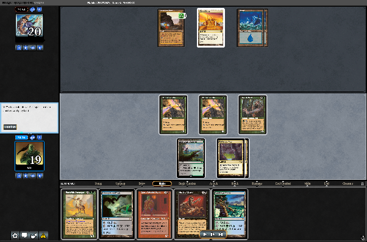

The opponent decided to reveal himself and was actually playing Iggy Pop. He tapped 3 mana trying to draw some cards for his next turn.

Great opportunity to kill him before he can do anything :)

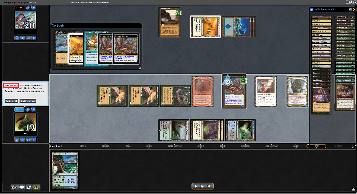

#### Example 4: Landstill

Context: it's Game 1. I played Birds on turn 1 and Survival on turn 2 but my opponent disenchanted it. I was able to activate Survival pitching Squee to fetch a Hermit Druid that survived the turn (opponent likely doesn't have an StP) and is now ready to be activated.

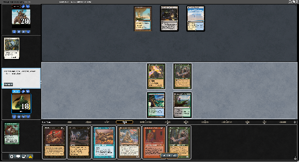

If I had 4 mana, I could activate Druid and go for Unearth holding Shallow Grave as insurance against any form of counterspell. But I only have 3 mana and don't want to risk activating Druid and potentially getting blown out by my opponent countering my Krosan Reclamation next turn.

So I decided to pass the turn and wait for my opponent to tap out or make a mistake.

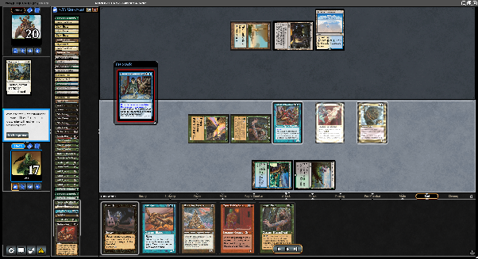

My opponent decided to cast Accumulated Knowledge at my end step, meaning it was a great moment to combo off. The only challenge was the fact that Palinchron was in my hand. Without Palinchron in the library, I don't have 20 CMC to shuffle with a single Scrounger activation and kill my opponent on my own turn. But given the fact my opponent signaled not having an StP on the previous turn (Hermit Druid survived), I decided the risk was worth it, so I comboed shuffling Akroma + ESG + ESG and, on his upkeep, I shuffled Scrounger + 2 cards to have more than enough damage and killed him with Shifter-Triskelion.

#### Example 5 (Puzzle): Shallow Grave + Survival

Context: It's Game 1 versus goblins. It's our opponent's end step and he is threatening to port us in our upkeep. What is the play?

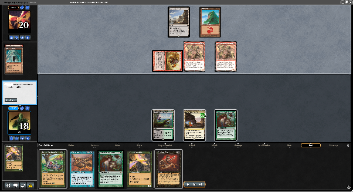

**Answer:**

At our opponents end step:

1. We tap Llanowar Wastes and pitch Palinchron fetching Volrath Shapeshifter
2. We tap Gemstone Mine (1 counter left) and pitch Volrath Shapeshifter for ESG

   During our upkeep, our opponent tries to tap one of our lands (let's assume he goes for Gemstone Mine, as that would be the worst case for us).

3. We remove ESG to add G and tap Llanowar Wastes for B and cast Shallow Grave, bringing back Volrath Shapeshifter and activating the Palinchron Trigger, untapping our lands
4. We add G with Llanowar Wastes and pitch BoP to fetch Phyrexian Devourer
5. Our Shapeshifter has haste, which means we can add G with it, since Birds of Paradise is at the top of our graveyard. We tap Shifter-Birds to add G and pitch Phyrexian Devourer to fetch Triskelion
6. Now we just pump and kill.

#### Exactly how it played out

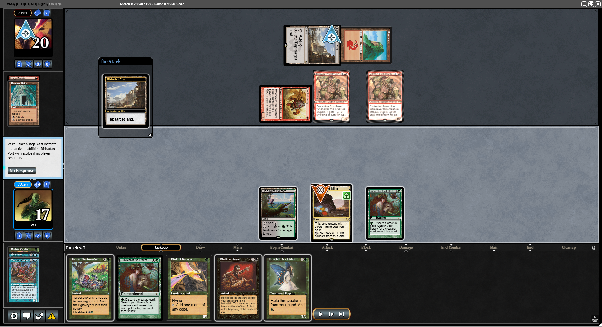

#### Example 6: Shallow Grave vs. Withered Wretch

Context: it's Game 2 against Money Ball Black. My opponent is stuck on 2 lands and has a Withered Wretch and a Hypnotic Specter in play that connected and, luckily for us, discarded my Ghitu Slinger.

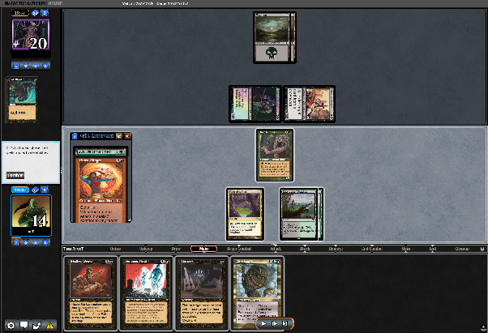

My play was: cast Shallow Grave in an attempt to bring back Ghitu Slinger and kill the Withered Wretch. My opponent erroneously tapped a Swamp and tried to exile the Ghitu Slinger (I don't blame him). Before the SG could resolve, I activated Hermit Druid putting both Volrath Shapeshifters on top. SG resolves, and we have a hasty Shifter. Now, we sac Druid targeting ourselves with Cabal Therapy (I was playing 2) to discard Psychatog and kill him with the hasty Shifter.

To be honest, I believe there was a stronger play. We could've activated the druid putting in order: Shapeshifter#1, Shapeshifter#2 and Karmic Guide, and played SG. If he allows a Shapeshifter to be reanimated, we can discard Psychatog and go for lethal with haste. If he exiles both shapeshifters, Karmic Guide enters the Battlefield, bringing back Palinchron. We untap 3 mana. After attacking for 2, we sac Karmic Guide to cabal therapy our opponent (we can name Withered Wretch). We can then play Animate Dead targeting Karmic Guide and bring back Scrounger, to ensure we set up our next turns. We also Unearth Ghitu Slinger to kill our opponent's Withered Wretch.

This approach doesn't win the game on the spot but it would be almost impossible for our opponent to deal with a Scrounger and Palinchron on board, and potentially an Akroma next turn (we can put Animate Dead on top of our library and go for the KG shenanigan again).

#### Example 7: Final Puzzle

Now, as a final exercise, let's imagine Example 6 if we had 4 mana instead of 3. We have to assess whether we can go for a Hermit Druid kill against a Withered Wretch with 2 mana up. Something usually unimaginable. Be warned that the possibilities are endless, and I may not even have picked the perfect graveyard order. Again… Shallow Grave complexity…

**Fair warning: this one is long and dense. If stack wars are not your thing, feel free to skip to the end of this section for the takeaway. If you have the physical cards, I'd advise following the step by step simulating it physically.**

Assess the situation and answer: Assuming our opponent doesn't have removal or a Dark Ritual, can we guarantee a kill?

I will just mention that below I will not cover every single possibility, as that would make this whole analysis a 30-page document. The opponent will always have the option of targeting multiple things with his Withered Wretch, but if he spends his mana and we still end up with either Akroma in the GY, a hasty Shifter that was pumped or a hasty Psychatog, he is dead. That is the premise behind all the lines that come next.

**Start:**

We start with 4 mana. We add (G) and activate Hermit (3 mana left).

Graveyard order (top to bottom):

1. Volrath Shapeshifter (Shifter#1)
2. Karmic Guide (KG)
3. Volrath Shapeshifter (Shifter#2)
4. Battlefield Scrounger (BS)
5. Wall of Roots (WoR)
6. Phyrexian Devourer
7. Triskelion
8. Akroma
9. Palinchron
10. Cabal Therapy (CT#1)
11. Cabal Therapy (CT#2)

We add (B) (2 mana left) and cast Unearth targeting Shifter#1.

> **Scenario 1.** Opponent activates WW to remove Shifter#1 or KG from top in response: We win the game by casting SG in response. Even if he responds again by exiling Shifter#1 or KG, we would end up with either a hasty Shifter or a KG bringing back Shifter#2. We could then discard Psychatog from our hand and attack for lethal damage. Exiling our Akroma from the GY also doesn't work, as Shifter#1 would come into play with haste. I believe 99% of players would be dead here. But let's keep going assuming they have perfect knowledge and information about our deck.

Shifter#1 enters the battlefield, triggering KG's battle cry targeting Palinchron.

> **Scenario 2.** Opponent exiles Palinchron in response (he has 1 mana left): We respond by casting SG, attempting to bring back KG. If it resolves, KG enters and targets Palinchron in the GY for the second time. Palinchron comes into play and we untap all our lands (4 mana left). We sac KG with CT#1 naming Snuff Out (or Abeyance) and put it back on top of our GY. We use 2 mana (2 left) and cast Animate Dead targeting KG. Triggers resolve. We bring back Shifter#2, KG and Scrounger. The top of our GY is now: Animate Dead, Shallow Grave, Unearth, WoR. We activate Scrounger to shuffle Animate Dead, SG and Unearth (total CMC: 5). We now have WoR on top of the GY and we use both Shifter#1 and #2 to add (2G) (4 mana total). We sac Scrounger with CT#2. We activate Shifter#1 and #2 to shuffle: ESG, Squee, Ghitu Slinger, SotF, Scrounger, WoR. Total CMC in the library: 23. We can now hold priority and activate Phyrexian Devourer 9 times to pump Shifter#1 by +23/+23. In response to the pump effects, we use our 2G mana to activate Shifter's ability to discard Psychatog, letting the triggers resolve, removing the Devourer from the top and revealing Triskelion to shoot for the win (if the opponent exiles Triskelion, we can kill him with Akroma and vice versa). If we needed more damage, we could even cast Krosan Reclamation shuffling +4 CMC into our library, as we still have 2 mana left.

**Continuing…**

Palinchron enters the battlefield, we add (1B) and untap our lands (we have 6 mana in total).

We cast Animate Dead targeting KG.

> **Scenario 3.** Opponent activates WW to remove KG in response: We let it resolve. The top of the GY is now Animate Dead, Unearth, Shifter#2. We then cast SG and win the game by having a hasty Shifter#2 that will be pumped by Psychatog. If the opponent removes Shifter#2, we can kill him with Shifter#1 or even use its ability to discard Psychatog in response to the SG resolution and kill him with a 20/21 hasty Psychatog.

**Continuing…**

Animate Dead resolves and we stack the AD and Karmic Guide triggers properly, targeting Shifter#2 and having KG on top of the GY.

> **Scenario 4.** Opponent activates WW to remove Shifter#2 in response to the KG trigger: We respond by adding 1G (2 mana left) and casting Krosan Reclamation targeting KG. After shuffling KG, we cast SG attempting to get the hasty Shifter#2 into play. (Same situation as Scenario #3: with only 1 mana left the opponent is dead.)

**Continuing…**

Shifter#2 enters the battlefield targeting KG.

KG enters the battlefield targeting Scrounger (if he attempts to remove it, we respond with SG).

We activate Scrounger to shuffle AD, Unearth and Squee, revealing WoR.

> **Scenario 5.** Opponent activates WW to remove Triskelion from our GY in response to the Scrounger activation, in an attempt to stop us from sacrificing it to Cabal Therapy. We allow it to resolve. We can add GG here (WoR on the top) with both Shifters. Still with the Scrounger trigger on the stack, we can pay (2) (4 mana left) and activate Shifter to discard Psychatog, and then play SG (2 mana left) to attempt to get a hasty Psychatog. If the opponent tries to remove it, we pump Shifter#1 (Psychatog is on the top of our library). We pump until Triskelion is revealed, with Akroma below it. Triggers and SG resolve, bringing back Triskelion. Because Akroma was below the Triskelion, for a fraction of a second both Shifter#1 and #2 see it on top and the legend rule sacrifice is triggered. We sac Shifter#2 (the one we haven't pumped). The top of the GY is now Shifter, SG, Akroma. We use the 3 counters of Triskelion to kill our Scrounger before its +3/+3 trigger resolves (we could also sac it to Cabal Therapy, but this approach is more fun). Now the graveyard order is Scrounger, SG, Shifter, Akroma. We activate the Scrounger ability with Shifter#1 to shuffle Scrounger, SG and Shifter#2, revealing Akroma and attacking for lethal damage. To be honest, we don't need to go through all the Triskelion shenanigans. Our Shifter#2 would be killed by its -0/-1 counter from a WoR activation the moment the Psychatog got removed from the top. But that line is more fun.

We sacrifice Scrounger with CT#1 and proceed to kill the opponent by replicating the line in Scenario 2, with a Psychatog and SG as backup against his 2 mana up.

**—End—**

### Verdict - Is it worth it to play Shallow Grave?

If this question were asked to a computer that can solve any calculation, I'm quite convinced the answer would be yes.

But we are not computers, so I believe it comes down to playstyle, and I will not pretend otherwise. I love solving puzzles and feeling I have outs to win games in unfavourable scenarios. I also think it is a really fun card to use and it makes Hermit Druid a real powerhouse against red decks, so I am heavily biased towards running 2 copies in my 75.

Using the last puzzle as an example:

Would it be feasible to calculate the exact order and lines during a high-pressure tournament game, predicting what the exact order of the graveyard should be, every line and every interaction from the opponent to find this win?

No!

But that is a bit of an extreme scenario.

Does it prove the point that Shallow Grave is a high-ceiling card that creates win conditions the deck would not otherwise have and increases its skill-cap and outplay potential? In my opinion, absolutely yes.

The fact that lines such as the one above can be created by simply playing the card means that if I play perfectly, I may have more outs. If I lose a game because I was not able to spot the win (as opposed to not having anything I could have done), it means I wasn't good enough or skilled enough to win. And if that is the case, I have ways to evolve, become a better player and improve with the deck.

So I guess the logic is: if you prefer consistency over outplay potential and hate misplaying (and you will misplay if you play the card), maybe it is not the best card for you.

But if you are still reading, you may as well try it (if you haven't already).

*Vinicius "vcT" Teixeira is a former Hearthstone pro who manages risk for an AI company by day and mills his entire library on purpose by night. A proud Brazilian, he is convinced picanha is the greatest thing ever done with fire. His wife thought the Magic phase was over. It was not. He is vcT on MTGO and Discord.*
