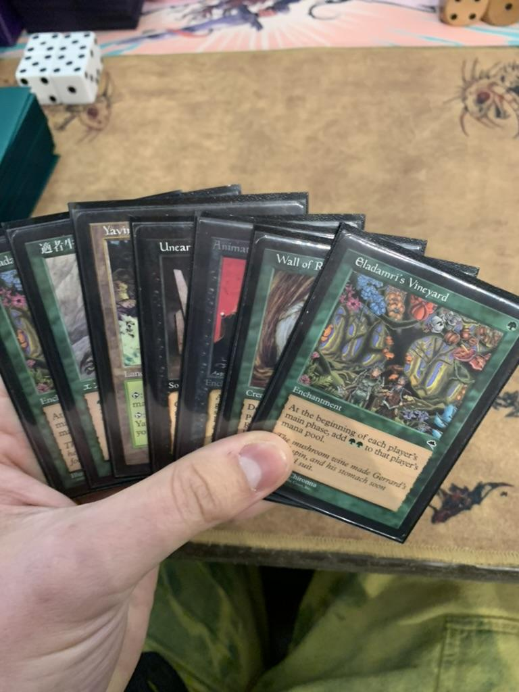

## Day 1

The story (for me) starts at Lobstercon 2026: first match, first game, first turn, swigging a bottle of wine (aka casting a turn one Vineyard in the blind). It goes just as you might imagine, the opponent responding politely with a turn one Petal-less Dreadnought! Of course, this is quite damning evidence *against* maindeck Vineyards, but even with the mana-boost allowing a T1 DN, my opponent still needed multiple pieces of interaction to prevent me from executing my own combo. That being said, this dreadful start still soured my first swig, plunging me into uncertainty over my choice to register not one, but two maindeck Eladamri's Vineyards for the biggest tournament I've ever played in.

Match after match, Vineyards were quickly dismissed to the sideboard for games 2 and 3, hardly showing their rosy–blushed cheeks in game ones, as if they knew they were in trouble and didn't want to risk being torn apart. This pattern continued as I roughed my way through some tough wins (Mirror Match, GBr Midrange, Sam Black Aluren, UDN), until round 6 when I FINALLY faced a Terrageddon deck. Spoiler: I mull to 4 both games and get crushed, with Vineyard granting a glimpse of hope but not enough to overcome the mulligans. Cut to next round: against one of the decks you hope never to see a single vitis vinifera, in a moment of ~~desperation~~ brilliance?? I cast a Vineyard into a stacked but stalled out Enchantress board. Lo and Behold! They take the bait, using a Seal of Cleansing on it during their turn to rob me of my expected harvest of GG. This is what we call the "green duress" – or perhaps here, the green Chaos Orb!? It allows me to land a survival and combo off for the win from what would have otherwise been an out-of-reach game.

Let's skip past this next round where I punt in a very close game vs Replenish, dropping to 5-3 on the day. Though *I* may have failed, my Vineyards continue their upward trend, and deliver me passage through the harrowing nightmare fields of a Devastating Dreams Terrageddon deck to stay in contention for day 2. Both game wins in this match relied heavily on Vineyards surviving and pumping out mana as my poor birds and lands are turned to mulch. The day started with betrayal, and ended with redemption, showing me a wild range of what is possible with a few glasses of wine from the vineyard.

## Day 2

If I was a bit skeptical after Day 1, by the end of Day 2, I had a warm spot in my heart for the hard work of a vigneron. To start the day, it shined against an unsuspecting GW Oath player, nullifying their hard work of immoral deeds. They were quickly set aside against a mana hungry Balancing Tings pilot, but were desperately needed in the following round against the mana denial of a 3c Terrageddon list. I was overcome by stacked hands and clutch draws from the Terrageddon player, but the Vineyards felt solid, making a close game of it despite the barrage of disruption.

In the next two rounds Vineyards were key in game one against both Stasis and UB Tog, allowing me to double spell early and get under these controlling decks – not to mention being resilient to a resolved Stasis.

Following Lobstercon, I've done a fair amount of Vineyard testing on mtgo, using various lists, exploring with others what a Vineyard main HFeb looks like. My main takeaways are:

- it's a beautiful card
- it can feel like cheating when you profit from it
- I'm not convinced it's necessary, but I'm convinced it's viable
- it's very good against some of our tougher matchups
- it needs more testing – not to see if it's good, but to see how best to play it, and what configurations work best
- it can be a liability if we reduce our total mana sources to include it, but then side it out in certain matchups
- I like it as a mainboard card better than a sideboard card
- the painless recurring mana allows for a midrange pivot

"The First Sip"

*Thanks to the sickos of the Howling Miners, McLean begun his premodern journey in 2022, with his first deck being Classic FEB. Now, under the strict rule of the CDC (aka Combo Discord Cabal,) he is forced to do hours of "what's the play" homework and divulge his secrets via blog posts. Some say he is the slowest Mtgo player and second slowest FEBer, may you never be in a rush and get queued up with him. He is @dunkers88 in Discord.*
