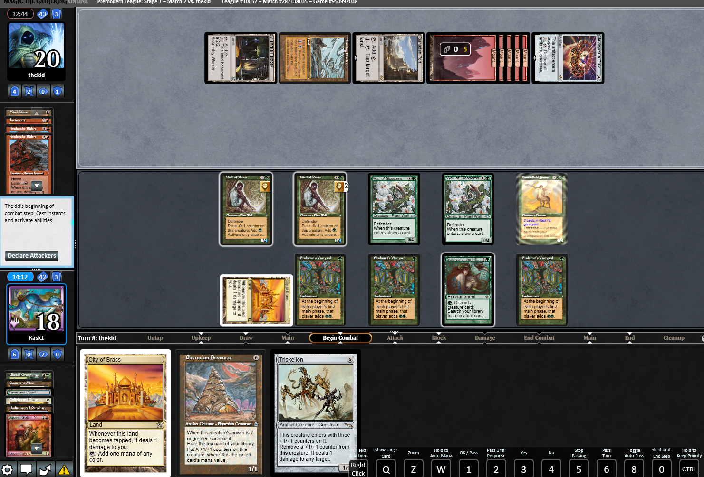

*Kask has only slung magic spells for about 3 years but has still managed to play more bad cards than most of you will in a lifetime, here's an unrelated text about Eladamri's Vineyard and making Galen angry. He is kask9768 on Discord.*

If you've been a part of the cabal discord for the past few months you've seen the endless discussions around this card about it's usefulness and also how bad it is and i took it upon myself to try it out on mtgo and in two decent sized tournaments since february(the danish nationals and easter champs in Gothenburg where i ended 16/127 and top8/62.

I've tried it both in main and in splits and in any range from 1-4 and have come to the conclusion that it belongs in the main, numbers may vary depending on your playstyle and meta. There's a lot of different reasons why I started playing it main but the bigger ones being finding slots is hard and it's a good enough card g1 versus most decks to function as a "sideboard card in the main" leaving more slots open in the SB.

So far i've only run into 3 terrible 100% always times to cast a t1 vineyard, that is OTP versus dreadnought (you can get it by a t1 DN) replenish and enchantress. The other decks are more nuanced and more depending on what cards your opponents have. G1 versus goblins is definitely an interesting discussion as it's less like they'll have interaction for your survival and the speed double G can give you might be enough to race that t1 lackey, especially OTP. You can even safe it up if you have a WoR+cabal and play WoR>Cabal on naturalize>Survival and pretty much ensure the win from there.

It's main uses is speed (mostly important into sligh but can even give you the extra edge versus a t2 DN or other faster decks that can't make use of the double G. The other big one is mana denial, specifically armageddon and ponza decks.

Thought i'd get the most frequently asked questions out of the way before i continue.

## F.A.Q

**What if they naturalize it?**
This is the funniest and one of the more common ones, the answer is simple, green duress. If you're dropping a vineyard t1 you're very likely following it up with a survival on t2. And even if it's a hermit hand it's still not the end of the world as it's just a 1 for 1 trade of cards and the only thing you lost was 1 mana on turn 1.

**What if they stone rain(or any other ponza card) you on t1?**
This is another frequently asked question when talking about the ponza match ups, the answer is pretty simple here too, that stone rain was going to hit you no matter what and having access to 2 very hard to interact with mana and 3 mana on your t2 makes up for it. If you can follow it up with something like WoR>WoR or a bird you're pretty much set to have a really good survival turn the following turn no matter how many LD's they throw at you.

**This only amplifies your survival lines and not your hermit lines.**
This one is partly true but not 100%, there's some things that become a lot easier even with the hermit lines especially through counter spells that I want to get into later.

With that out the way lets get into more specific scenarios and match ups.

### Sligh/Burn

This was the accidental upside when vineyard first entered the discussion as a card versus ponza. Our current plan versus the red deck is just to race them with survival and hope they don't kill us before that.
A turn 4 win is usually doable versus them with the right cards, especially if we also have unearth/animate dead. The issue is that turn 4 is also a turn we commonly die to them since we're eating a lot of pain from our lands and we rarely interact with what they're doing. Vineyard gives us 2 PAINLESS green mana versus a deck that at best can cast an incinerate for 1 t2 with it. (and obv other cards like sulfuric vortex but this is not a card we're afraid of). It also speeds up our win by entire turn in most cases. It's also very likely they're tapped out at earlier turns rushing out all their permanents making our win even easier.

### RG/RGW/GW Ponza/Terrageddon

This is the deck where the card shines the most. One of the bigger issues we have versus these kinds of decks is that it's hard to keep hands with anchors unless we can back it up with lots of lands. Vineyard fixes this, it allows us to set up our board with mana dorks through LD with survival in play. A notable thing is that we don't necessarily have to rush vineyard out versus them if we can't use the mana properly. It can also be used as a catch-up effect after the first few LD effects.

### Vineyard with hermit

This is a talking point that's been brought up a decent amount of times. While it doesn't speed up our hermit lines the same way birds do due to the limitation of mainphase mana it can still help us speed out hermit wins through counterspells. It allows us to cast more creatures on t2/t3 to be used as cabal fodder while still having mana to cast k-rec in our main. Another fun niche interaction is that once we shuffled in our animate dead, the following turn if we have 3 lands we can bring back squee for an extra cabal before casting AD. It can let us get under a lot of control decks game 1 and even catch a lucky topdeck. While birds still is the faster way, vineyard is not completely irrelevant with hermit. A thing to note in this section is that vineyard is rarely bad into blue control decks.

### Stasis

What do you think?

### The rest of the field

I don't have much more to say here that wasn't mentioned in the beginning, we can often do way more with the double G mana acceleration than our opponent can, especially game 1 where interaction is less likely. (This is not counting replenish/enchantress). This is granted we have an anchor and a gameplan to use the mana, otherwise it should never be cast. This is why I started running it in main.

### Sideboarding

This isn't fully tested yet and there's probably match ups where you could in theory keep them in (blue decks comes to mind)but they're generally on the chopping block for me to fit other SB cards, it's a neat upside actually, made sideboarding hell of a lot easier.

**Bonus picture**

